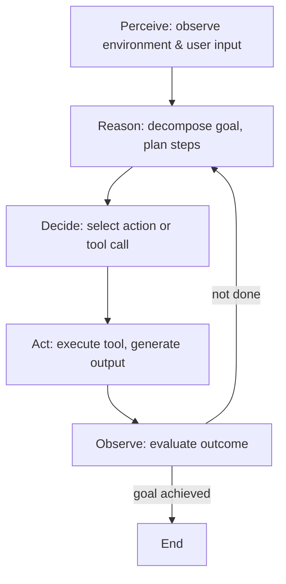

# Agentic AI — The Next Frontier Beyond Generative Models

The AI landscape is shifting. In 2023–2025, we marvelled at large language models that could write, code, and converse. But 2026 is shaping up to be the year of **agentic AI** — systems that don't just generate content, but *act*.

Agentic AI represents a fundamental evolution: from models that respond to prompts, to autonomous agents that perceive their environment, formulate plans, use tools, and execute multi-step tasks with minimal human supervision. This isn't just a better chatbot — it's a different relationship between humans and machines.

---

## What Makes an AI "Agentic"?

An agentic AI system possesses several capabilities that distinguish it from a standard LLM:

### 1. Autonomy & Goal-Directed Behaviour

Traditional LLMs are *reactive* — you prompt, they respond. Agentic systems are *proactive*. Given a high-level goal, they decompose it into sub-tasks, sequence actions, and adapt when plans go wrong. Think of the difference between asking ChatGPT to "write an email" versus asking an AI agent to "handle my inbox for the week — prioritise urgent messages, draft responses, and schedule follow-ups."

### 2. Tool Use & Environment Interaction

Agentic AIs move beyond text-in/text-out. They interact with external systems through APIs, databases, browsers, code execution, and even physical actuators. This *grounding* in the real world is what transforms them from language processors into genuine problem-solvers. An agent might query a database, run a Python script to analyse the results, visualise the output, and then write a summary — all in a single autonomous loop.

### 3. Planning & Reasoning

The heart of agentic behaviour is **planning**. Modern agents employ techniques like:

- **Chain-of-Thought (CoT)**: Step-by-step reasoning before acting
- **ReAct** (Reasoning + Acting): Interleaving thought with tool calls
- **Tree-of-Thoughts**: Exploring multiple reasoning paths simultaneously
- **Plan-and-Execute**: Generating a full plan upfront, then methodically executing each step

Each approach trades off deliberation against action — and the best agents know when to think and when to act.

### 4. Memory & Context

Unlike stateless LLMs, agentic systems maintain **short-term** (conversation history, working memory) and **long-term** memory (vector stores, knowledge graphs, past experiences). This persistence allows them to learn from previous interactions, build user models, and maintain coherent behaviour across extended time horizons.

### 5. Multi-Agent Coordination

Perhaps the most exciting frontier is **multi-agent systems** — teams of specialised AI agents that collaborate, negotiate, and delegate. One agent might research a topic, another writes the report, a third fact-checks, and a fourth formats the output. The emergent intelligence from agent collaboration often exceeds what any single model can achieve.

---

## From Digital Twins to Autonomous Agents

This shift toward agency resonates deeply with my own work on **Digital Twin ALMA**. A digital twin isn't just a static model — it's a *living simulation* that ingests real-time data, runs counterfactual scenarios, and surfaces actionable insights to decision-makers. In many ways, a digital twin *is* an agentic system: it perceives the state of the world through data streams, reasons about possible futures through simulation, and recommends actions.

The convergence of agentic AI and digital twins opens up compelling possibilities. Imagine:

- A **public health agent** that continuously monitors outbreak signals, runs simulations on the Large Population Model, and autonomously recommends targeted interventions — complete with uncertainty estimates and trade-off analyses.
- A **policy agent** that can explore thousands of "what-if" scenarios overnight, presenting decision-makers with ranked options and their predicted downstream effects.
- A **research agent** that formulates hypotheses, designs simulation experiments on the LPM, interprets results, and iterates — accelerating the scientific discovery cycle.

These aren't science fiction. The building blocks exist today.

---

## The Architecture of an Agentic System

At a high level, most modern agentic architectures share a common loop:

Key architectural components include:

- **Orchestrator/Controller**: The central loop that manages the agent's decision cycle
- **LLM Core**: The reasoning engine — typically a frontier model like GPT-4, Claude, or Gemini
- **Tool Registry**: A catalog of available functions the agent can invoke (APIs, code executors, search engines, etc.)
- **Memory Store**: Short-term (in-context) and long-term (vector DB, relational) storage
- **Safety Guardrails**: Constraints, human-in-the-loop checkpoints, and action validation layers

---

## Challenges & Open Problems

Agentic AI is promising, but significant challenges remain:

### Reliability & Hallucination
Agents that can *act* are orders of magnitude more dangerous when they hallucinate. A chatbot hallucinating a fact is annoying; an agent hallucinating a bank transfer is catastrophic. Robust verification layers, sandboxed execution, and human-in-the-loop approvals are essential safeguards.

### Alignment & Value Specification
How do you encode complex human values into agent goals? The *alignment problem* becomes more acute when agents operate autonomously over long time horizons. Techniques like Constitutional AI, RLHF, and debate-based oversight are active research areas.

### Tool Reliability & Error Handling
Agents depend on external tools that may fail, return unexpected formats, or time out. Building robust error-handling and retry logic is a significant engineering challenge. Agents need to *know when they don't know* and gracefully degrade.

### Multi-Agent Coordination Complexity
As the number of agents grows, coordination overhead increases. Communication protocols, task allocation, conflict resolution, and emergent behaviours all become harder to predict and control. The field of **multi-agent reinforcement learning (MARL)** offers some frameworks, but general-purpose multi-agent LLM systems are still in their infancy.

### Cost & Latency
Planning and reasoning require many LLM calls — each with associated latency and API costs. A single complex task might involve dozens of model invocations. Optimising for efficiency without sacrificing capability is an ongoing challenge.

---

## Where We're Heading

Looking ahead, I see several trends converging:

1. **Smaller, Specialised Agents**: Not every agent needs a 1-trillion-parameter model. Task-specific fine-tuned models running locally will handle specialised roles, with larger models reserved for complex reasoning.

2. **Agent-Native Infrastructure**: We'll see the rise of platforms designed *for* agents — managed memory, built-in tool registries, observability dashboards, and governance frameworks.

3. **Human-Agent Collaboration**: The most impactful systems won't be fully autonomous. They'll be *co-pilots* — working alongside humans, escalating ambiguous decisions, and learning from feedback.

4. **Regulation & Standards**: As agents gain autonomy, expect regulatory frameworks around accountability, transparency, and safety testing — much like we see in autonomous vehicles.

5. **Convergence with Digital Twins & Simulation**: Agentic AI will supercharge simulation-based decision support. Agents will design experiments, run simulations, interpret results, and communicate findings — dramatically accelerating the "sense → model → decide → act" cycle.

---

## Closing Thoughts

Agentic AI marks a pivotal shift — from AI as a *tool we wield* to AI as a *collaborator we work with*. The distinction matters. Tools are predictable; collaborators require trust. Building that trust — through reliability, transparency, and meaningful human oversight — is the defining challenge of this era.

We're not building better chatbots. We're building systems that can reason, plan, and act in the world. And that changes everything.

---

*What are your thoughts on agentic AI? Have you experimented with building autonomous agents? I'd love to hear about your experiences — reach out via the [contact form](/#contact) on my website.*
